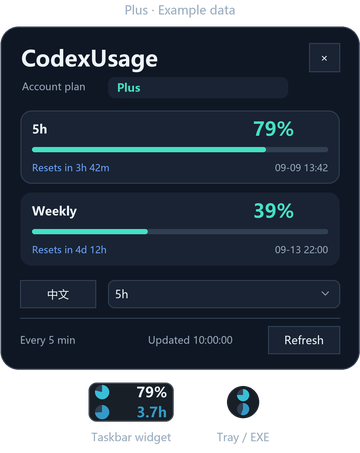
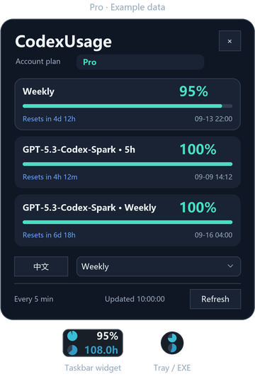

# CodexUsage

[简体中文](README.md) | [English](README.en.md)

A lightweight Windows widget for Codex quota and reset time, next to the notification area.


## Features

- The cyan disk and percentage show remaining quota; the blue disk and countdown show time left in the same window.
- Shows all returned quota windows, with the same display rules for Plus and Pro.
- Refreshes automatically every five minutes, with manual refresh available.
- Saves your Chinese / English preference; fixed 100% app sizing follows Windows system DPI.

## Examples

Example data; available quota windows depend on the account's actual response.

### Plus



### Pro



## Download and run

Requires Windows x64, .NET Framework 4.8 or a newer 4.x version, and Codex installed and signed in with a subscription account.

1. Download `CodexUsage.exe` from Releases, or download and extract `CodexUsage-Windows-x64.zip`.
2. Keep the app in a writable folder and run `CodexUsage.exe`.

Currently a preview. See [TESTING](docs/TESTING.md) for verification scope.

## Development

```powershell
./scripts/build.ps1
```

[BUILD](docs/BUILD.md) · [TESTING](docs/TESTING.md) · [PRIVACY](docs/PRIVACY.md)

## License

[MIT](LICENSE) · Amygdala42
