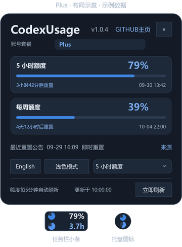
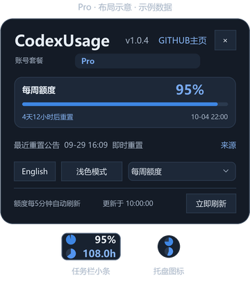
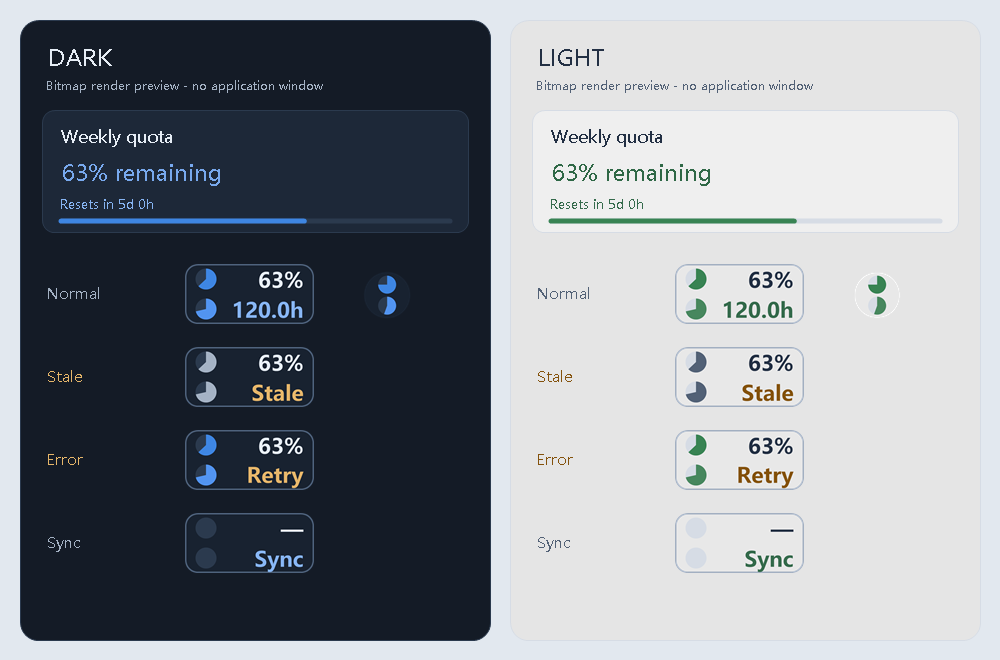

# CodexUsage

[简体中文](README.md) | [English](README.en.md)

轻量 Windows Codex 额度小窗，在任务栏通知区旁查看剩余额度和重置倒计时。

**[下载 v1.0.4 · CodexUsage.exe](https://github.com/Amygdala42/CodexUsage/releases/download/v1.0.4/CodexUsage.exe)** · [ZIP 程序包](https://github.com/Amygdala42/CodexUsage/releases/download/v1.0.4/CodexUsage-Windows-x64.zip) · [更新说明](https://github.com/Amygdala42/CodexUsage/releases/tag/v1.0.4)

适用于 Windows x64。

本地蓝绿配色修订（版本仍为 v1.0.4）：深色采用深蓝灰背景与更鲜明的双蓝强调，浅色采用柔和浅灰背景与双绿强调。饼图、额度数字、倒计时、进度条与菜单在各自主题中保持同一色系，并验证文字和有效图形的对比度。该修订尚未替换上方 GitHub 发行附件。


## 功能

- 上行圆盘和百分比表示剩余额度，下行圆盘和倒计时表示同一周期的剩余时间。
- 按实际返回显示额度卡片；Plus、Pro 使用相同规则，已移除 Spark 额度。
- 每 5 分钟自动刷新，也可手动刷新。
- 显示最近公共重置公告的时间和类型，点击来源查看原文；公告不代表个人账号到账。
- 中英文切换并保存偏好；应用尺寸固定 100%，跟随 Windows 系统 DPI。
- 深色／浅色模式即时切换，自动记住选择；旧设置默认沿用深色。

## 界面示例

以下为 v1.0.4 布局示意图，使用示例数据，并非真实账号截图；额度项目以账号实际返回为准。

### Plus



### Pro



### 深色与浅色

下图使用程序实际绘图代码和示例数据，展示两种主题及正常、过期、失败、更新中状态。



## 下载与运行

需要 Windows x64、.NET Framework 4.8 或更新的 4.x 版本，以及已安装并登录订阅账号的 Codex。

1. 在 Releases 中下载 `CodexUsage.exe`，或下载 `CodexUsage-Windows-x64.zip` 后解压。
2. 运行 `CodexUsage.exe`。点击额度条查看详情，鼠标移开后自动收起。

悬停额度条可查看简要说明，移开或点击即关闭；右键打开菜单。详情顶部可查看版本号，并打开 GitHub 项目主页。

切换外观：点击详情页中的“浅色模式／深色模式”按钮，或在额度条／托盘图标上右键，选择“外观 → 深色模式／浅色模式”。语言、主题和额度选择位于同一行。深色以深蓝灰背景配更鲜明、较浓的双蓝饼图（#3E86E3 / #5294F0），浅色以柔和浅灰背景配双绿饼图（#388353 / #47875E）；额度进度条与额度饼图使用同一主强调色。文字使用同色系中满足可读性的色阶，普通状态在深色中统一为蓝色系、浅色中统一为绿色系。过期状态使用中性灰和琥珀色提示，下拉列表活动行有清晰的强调色边框。主题切换无需重启；下次启动恢复上次选择。

升级时先从托盘退出旧版，再替换 EXE。设置保存在 `%LOCALAPPDATA%\CodexUsage`，首次运行会导入同目录旧版的设置。

验证范围见 [测试说明](docs/TESTING.md)。

## 开发

当前版本为 **v1.0.4**（2026-09-30），EXE 文件与程序集版本为 **1.0.4.0**。包含深浅主题切换、单行设置布局、通信输入编码与公告缓存修复，以及任务栏遮挡浮条时按层级变化事件恢复。本地蓝绿配色修订通过 265 项自动检查（包含图形与文字对比度）；原生 GUI、真实 Plus 账号及其他多屏幕/DPI 场景的验证范围见 [测试说明](docs/TESTING.md)。

```powershell
./scripts/build.ps1
./scripts/test.ps1 -Suite All
```

[构建说明](docs/BUILD.md) · [测试说明](docs/TESTING.md) · [隐私说明](docs/PRIVACY.md)

## 许可

[MIT](LICENSE) · Amygdala42
